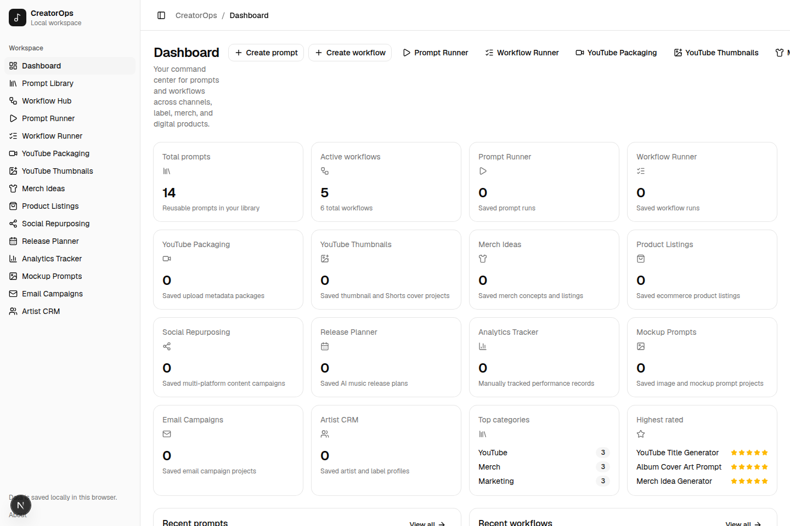
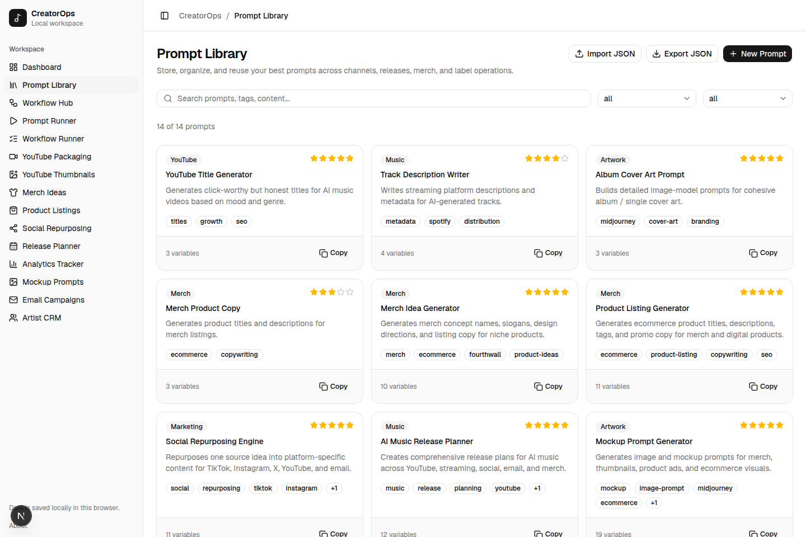
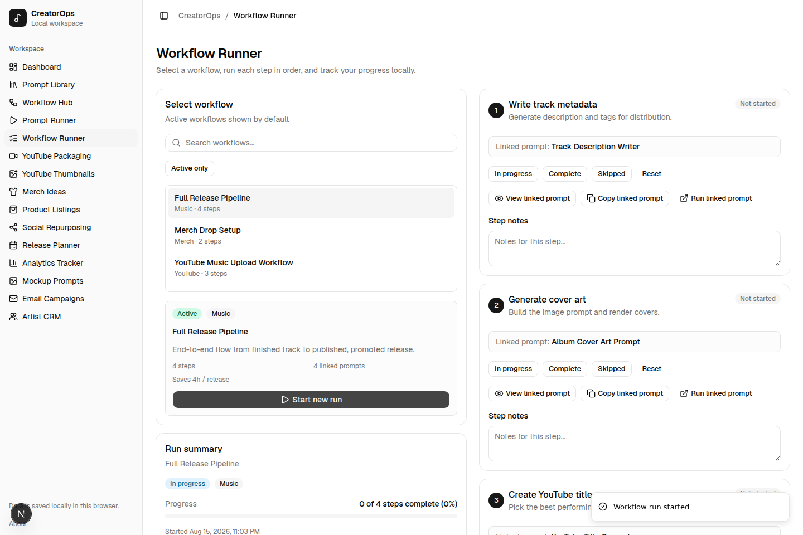

# CreatorOps

**A local-first productivity dashboard for solo creators** — prompts, workflows, an artist CRM, and content-packaging tools for running AI music channels, a label, and merch/digital product stores, all from one place.



## What this is

CreatorOps started as a personal command center for [Dorsyth Digital](https://dorsyth.com/digital) — a way to stop losing good prompts in chat history, stop re-typing the same YouTube metadata by hand, and keep a release, a merch drop, or an artist signing moving through a repeatable checklist instead of a scattered mental list.

It's built for **one person running several small operations at once**: an AI-music channel, a label, an artist roster, and a merch/digital-product storefront. If that's not your exact setup, the underlying idea — a reusable prompt library wired into multi-step workflows, with a lightweight CRM alongside it — still generalizes to most solo-creator or small-team content operations.

This is **not** SaaS. It's a single-tenant, single-browser tool with no accounts, no server-side database, and no multi-user support. See [Limitations & current status](#limitations--current-status) below.

## Who it's for

- Solo creators or very small teams running multiple content pipelines (channel + label + store) who want one dashboard instead of five spreadsheets and a Notes app.
- Anyone who wants a working example of a **local-first Next.js app**: no backend, all state in the browser, SSR-safe hydration done right.

## Feature areas

| Area | What it does |
|---|---|
| **Prompt Library** | Save, tag, rate, and reuse AI prompts with `{{variable}}` templating. Import/export as JSON. |
| **Workflow Runner** | Chain prompts into ordered, trackable workflows (e.g. "Full Release Pipeline") with per-step status, notes, and progress. |
| **Artist CRM** | Track artists, releases, merch products, and campaigns, each linkable to the records generated elsewhere in the app. |
| **YouTube Packaging & Thumbnails** | Generate titles, descriptions, tags, pinned comments, and thumbnail concepts for a video, saved as reusable records. |
| **Release Planner** | Build a full pre-/post-release plan (14-day countdown, release-day checklist, promo copy) for a single or EP. |
| **Merch Ideas & Product Listings** | Generate merch concepts and ecommerce listing copy (titles, bullets, tags, CTAs). |
| **Social Repurposing** | Turn one source idea into platform-specific copy for TikTok, Instagram, X, YouTube, and email. |
| **Email Campaigns** | Draft subject lines, preview text, and multiple body variants for a launch or announcement. |
| **Mockup Prompts** | Build detailed image-generation prompts for merch mockups, thumbnails, and ad creative. |
| **Analytics Tracker** | Manually log performance metrics per item/platform and get sortable, filterable summaries. |



The Workflow Runner is the piece that ties it together — chaining saved prompts into an ordered, trackable process instead of a one-off generation:



## Tech stack

- **Framework:** [Next.js 16](https://nextjs.org) (App Router, Turbopack) + React 19
- **Language:** TypeScript, `strict` mode
- **UI:** Tailwind CSS v4, [Base UI](https://base-ui.com/) primitives (dialogs, selects, tooltips, etc.), [lucide-react](https://lucide.dev) icons
- **State:** React Context + `useSyncExternalStore`-backed stores over `localStorage` — no external state library, no server
- **Testing:** [Vitest](https://vitest.dev)
- **Linting:** ESLint 9 (flat config) via `eslint-config-next`

## Architecture

CreatorOps has no backend. Every read and write terminates in the browser's `localStorage`:

```
Browser
  ↓
Next.js / React  (App Router, all routes are client components)
  ↓
Feature modules  (lib/*.ts — pure business logic: templating, normalization, derived state)
  ↓
localStorage      (lib/storage.ts — one JSON blob per data type, SSR-safe reads)
```

- `lib/storage.ts` owns every `localStorage` key and the load/save functions for each data type, each guarded so they're safe to call during server rendering (they return seed/empty data on the server, since `localStorage` doesn't exist there).
- `lib/store.tsx` exposes one `useStore()` hook to the whole app. Internally each data slice is a small external store read through React's `useSyncExternalStore` — the officially correct pattern for client-only, mutable data sources, and the reason there's no hydration-mismatch flicker or loading spinner on first load.
- `lib/<feature>.ts` files hold the pure logic per feature (form defaults, prompt templates, defensive "normalize" functions that backfill missing fields on records loaded from storage, derived status calculations).
- `components/<feature>/` holds the feature UI; `components/ui/` is a small internal component kit built on Base UI primitives.

This is a deliberate choice for the current scope, not a missing feature: a solo creator's tool doesn't need a server, and shipping one would add real operational cost (hosting, auth, a database, backups) for no benefit at this scale. See [Roadmap](#roadmap) for what a server-backed version would need to change.

## Local setup

```bash
git clone https://github.com/bryan0578/creatorops.git
cd creatorops
npm install
npm run dev
```

Open [http://localhost:3000](http://localhost:3000). No environment variables, no external services, and no database to provision — the app is fully usable the moment `npm run dev` starts. Data lives in your browser's `localStorage`, scoped to `localhost:3000`; clearing site data resets it back to the seed prompts/workflows.

### Commands

| Command | What it does |
|---|---|
| `npm run dev` | Start the dev server (Turbopack) at `localhost:3000` |
| `npm run build` | Production build, with full type checking |
| `npm start` | Run the production build |
| `npm run lint` | ESLint |
| `npm test` | Run the Vitest suite |

### Prerequisites

- Node.js 20+ and npm (the repo is developed against Node 22)
- No database, API keys, or environment variables required

## Project structure

```
app/                     Route segments (App Router) — one folder per feature page
components/
  <feature>/              Feature-specific UI (e.g. components/workflows/)
  ui/                      Internal component kit (button, dialog, select, table, ...)
hooks/                    Shared hooks (e.g. useIsMobile)
lib/
  store.tsx                useStore() — the single state entry point for the whole app
  storage.ts                localStorage read/write + the useSyncExternalStore store factory
  <feature>.ts              Pure logic per feature: form defaults, templates, normalize*, derived state
  types.ts                  Shared TypeScript types and enums
  *.test.ts                 Vitest tests, colocated with the code they cover
public/                  Static assets
```

## Data storage model

Every record type (prompts, workflows, workflow runs, YouTube packages, merch ideas, analytics records, artist-CRM records, …) is stored under its own `creatorops:*` key in `localStorage` as a JSON array. Reads go through a `normalize*` function per type that backfills any missing/malformed fields with sane defaults — so data survives schema changes across app updates without a migration step. There is no server sync: switching browsers or devices means switching data.

## Dorsyth Digital

CreatorOps is a [Dorsyth Digital](https://dorsyth.com/digital) product — the internal tool built to run Dorsyth's own AI-music and merch operations day to day. It's shared here as a portfolio piece and as a working example of a local-first Next.js app; it doesn't expose any Dorsyth business data — the seed prompts/workflows shipped in this repo are generic examples, not real operational content.

## Limitations & current status

- **Single browser, single device.** Data lives in `localStorage` and does not sync across browsers, devices, or team members.
- **No auth, no multi-user support.** Anyone with access to the browser has full access to the data.
- **No automated backend backups.** Use the built-in JSON export on each feature page if you want a portable copy.
- **No automated test coverage for UI components** — the test suite currently covers the pure business-logic layer (`lib/`), not component rendering or interaction.

## Roadmap

Rough shape of what a server-backed version would need, if/when this outgrows local-only storage:

- A persistence layer (e.g. Postgres) behind the existing `lib/storage.ts` interface, so `load*`/`save*` swap implementations without touching feature code
- Auth, so data isn't tied to one browser
- Real analytics ingestion (YouTube/Spotify APIs) in place of the manually-logged Analytics Tracker
- Component-level test coverage alongside the existing business-logic tests

## License

[MIT](./LICENSE)
